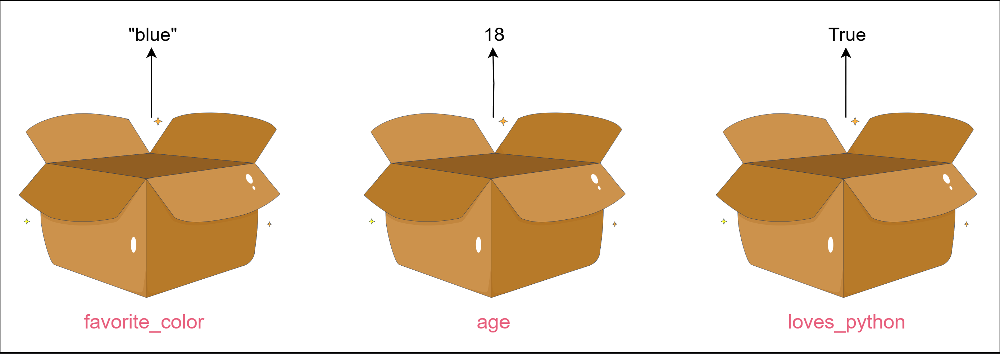

## Teach Your Code to Remember Things!

**Learn how to store and use data with variables.**

- So far, Python has said hello and done math. But now it’s time to give it a memory.

- We’re going to learn how to make Python remember things using variables.

## Teach Python to remember

- Think of a variable like a label for a box. We can store something inside, and later, we can ask Python to use it again.

refer - [variables_basics.py](./variables_basics.py)

## What just happened?

**We executed the following:**

- Created a variable with =, like name = "Ava".

- Used print() to show what’s inside.

- This lets us reuse values, change them, and keep our code tidy.

**Important: Variable names can’t have spaces. Use _ instead, like favorite_food.**

**Try to create our own variable and print it out. Here are a few ideas:**

refer - [variables_basics.py](./variables_basics.py)

### Different types of variables

1. Text ("strings") like "blue"

2. Numbers like 18

3. True/False values (called booleans)

### Mix it up

**We can use variables in expressions, too. You can think of an expression like a math sentence or instruction—it can include numbers, text, variables, and even symbols like + or -. Python figures them out step by step, just like solving a small puzzle.**

refer - [variables_basics.py](./variables_basics.py)

### What’s next?

**In the next hands-on project, you'll make Python remember some fun facts about you—like your name and age—and then display them in a complete sentence. You’ll combine variables with print() to create a personalized message, using the skills you just learned. It’s time to let your code tell your story!**

## Quick recap

**We just learned:**

- How to create and use variables in Python

- How to store text, numbers, and booleans

- How to use variables in print statements and calculations

---

## Mix Words and Numbers

Now that Python can remember things, let’s make our messages more dynamic!

This lesson will teach us how to combine words and numbers to create full sentences using variables.

